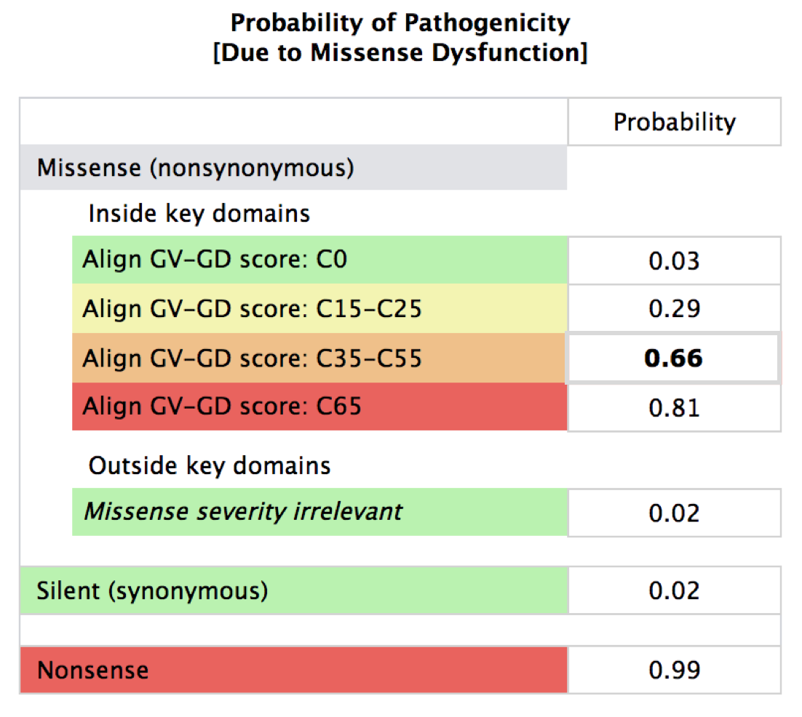
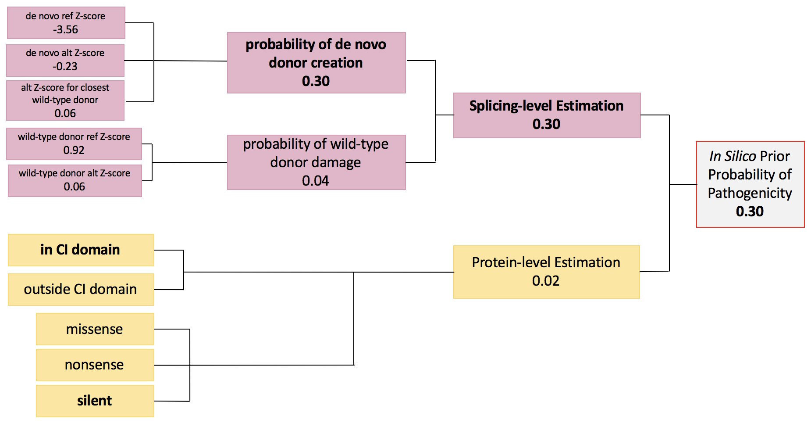
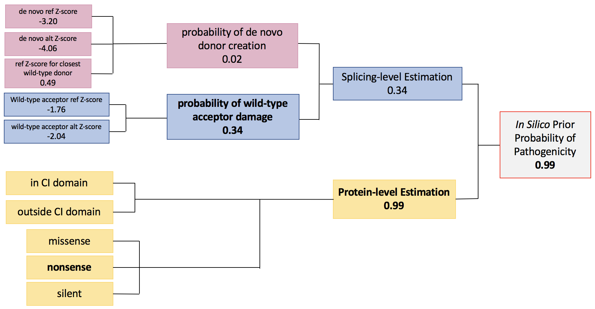
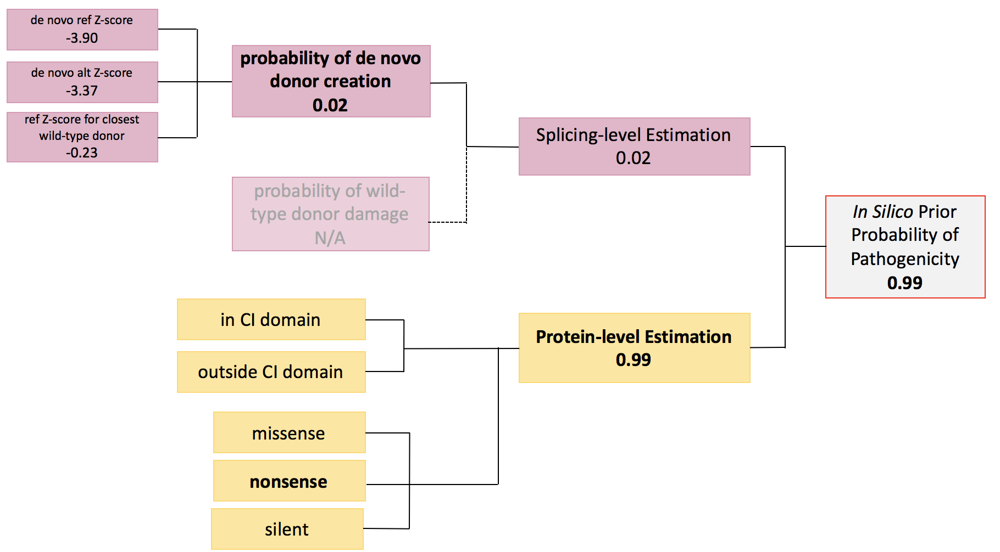
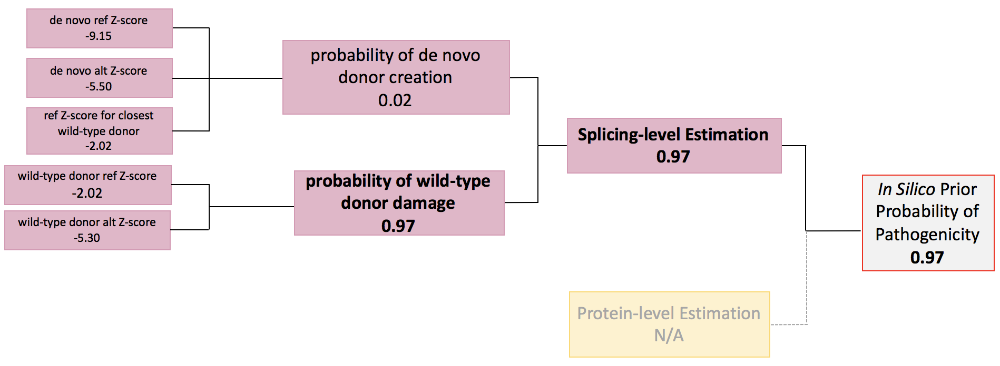
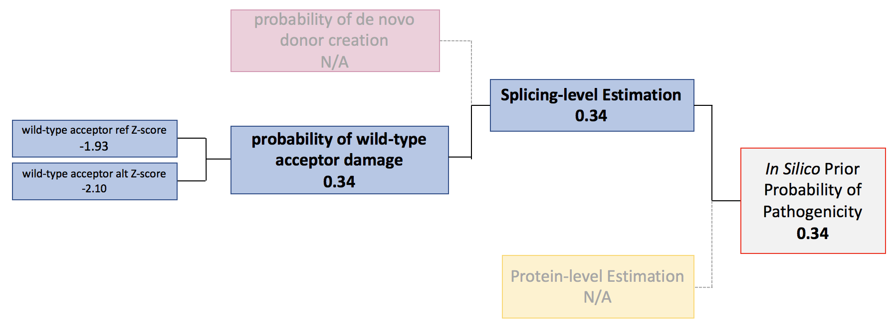

# Scoring Systems for Splicing-level and Protein-level Estimations

The *In Silico* Prior Probability of Pathogenicity is the greater of two predicted values: the Protein-level Estimation and the Splicing-level Estimation.

## Protein-level Estimations: Align-GVGD Scores

For all exonic variants, the “Protein-level Estimation” is calculated using Align-GVGD scores, which assess the protein-level importance of a region per sequence conservation measures and assessments of physiochemical properties. The following figure demonstrates the probabilities of pathogenicity that are used to assign Protein-level Estimation based on variant type (nonsense, missense, silent) and variant location. The estimation accounts for variant location by assessing whether the variant is inside or outside Clinically Important Functional Domains (henceforth CI Domains). CI Domains are modeled according to ENIGMA's designations.

A generalized schema for estimating Protein-level impact is:

Variant Type → Variant Location (Exonic, CI Domain) → Protein-level Estimation

## Splicing-level Estimations: Z-scores and Associated Probabilities

The Splicing-level Estimation is a value that demonstrates the highest possible impact the variant could have on mRNA splicing. Splicing is important since it can have significant impacts on the resulting protein such as a completely different amino acid sequence or early truncation. A generalized schema for Splicing-level Estimations is:

Z-scores → Wild-type and De Novo Probabilities →  Splicing-level Estimation

Z-scores measure probability of splicing impact. Alternate Z-scores, or Z-scores for the alternate sequence introduced by the variant, measure the probability that the variant affects  splicing. The alternate Z-scores are compared to reference sequence Z-scores to account for the inherent splicing likelihood in the region, which is often low. Predictions are made about splicing impact using these Z-scores; probabilities of pathogenicity associated with minimal (or weak/null), moderate, and high impact are assigned as the predicted probabilities listed in the tables below. There are also probabilities assigned to variants that either improve splicing likelihood or occur outside splice regions.

The Splicing-level Estimation is determined by assessing the variant on two levels, using two sets of Z-scores. A variant is not only assessed for how the altered sequence affects the wild-type splice site (*probability of wild-type acceptor damage, probability of wild-type donor damage*), but also assessed for how it may introduce new, or de novo, donor splice sites (*probability of de novo donor creation*). 

A Z-score greater than 0 (or 0.5) indicates a better than average likelihood of splicing. If a Z-score is greater than 0 for a *wild-type donor*, splicing function is predicted to be retained despite the mutation. However, a Z-score greater than 0 for a *de novo donor* indicates possible interference of wild-type splice function. In this case, likelihood of splicing outside the wild-type splice site is increasing. The Z-score ranges associated with probabilities of pathogenicity in the case of wild-type donor damage, wild-type acceptor damage, and de novo donor creation are provided below.

Examples and schemas for how these calculations are made for BRCA Exchange are available in following sections.

# Examples of Calculation Schemas for *In Silico* Prior Probabilities

Below you will find examples of numerous variants across different locations in the *BRCA1* or *BRCA2* gene. Location and information related to splice donors are indicated by pink, while splice acceptors are indicated by blue.

### Exonic Variant Located in a Wild-Type Splice Site's Donor Region

Example: [BRCA1 c.132C>T](http://brcaexchange.org/variant/105248)

Because the variant is located in an exon and in a wild-type donor splice site region, the following priors are used in predicting the *In Silico* Prior Probability of Pathogenicity:

*   De Novo donor probability (Splicing-level Estimation)
*   Wild-type donor probability (Splicing-level Estimation)
*   Protein-level Estimation

The *In Silico* Prior Probability of Pathogenicity is assigned per the Splicing-level estimation, because the estimated splicing-level impact (0.30)  is greater than estimated protein-level impact (0.02).

Though the variant is in a CI domain, it is a silent mutation. Accordingly, the Protein-level Estimation assigned is low, with a value of 0.02.

The Splicing-level estimation is considered moderate, or 0.30, and is due to the de novo donor probability, which is higher than wild-type donor probability. The de novo alternate Z-score is greater than -2 but less than 0, indicating moderate probability of splicing interference due to de novo splice site creation. It is also worth noting that the de novo alternate Z-score is significantly greater compared to the de novo reference Z-score, implicating that the splicing probability in that region has increased. Conversely, the wild-type donor probability is considered low (0.04) because the wild-type donor alt Z-score is greater than 0; splicing probability in the wild-type donor is retained despite the variant’s presence in that region.

### Exonic Variant Located in Wild-Type Splice Site's Acceptor Region

Example: [BRCA1 c.442c>t](http://brcaexchange.org/variant/104977)

Because the variant is located in an exon and in a wild-type acceptor splice site region, the following values are used in predicting the *In Silico* Prior Probability of Pathogenicity: 

*   De Novo donor probability (Splicing-level Estimation)
*   Wild-type acceptor probability (Splicing-level Estimation)
*   Protein-level Estimation

This variant is a nonsense variant, so the *In Silico* Prior Probability of Pathogenicity is ultimately assigned per the protein-level estimation (0.99), which is a higher predicted probability of pathogenicity than the splicing-level estimation (0.34).

The Splicing-level Estimation is considered moderate, 0.34, and is due to the wild-type acceptor probability. The wild-type acceptor alt Z-score is less than -1.5, which is normally considered a high acceptor splice site prediction. However, the wild-type acceptor ref Z-score is already less than -1.5, meaning that the acceptor site has a low prediction before the introduction of the variant, though splicing probability is still decreased by the presence of the variant. A moderate score of 0.34 is thus assigned due to a decrease, but not a drastic decrease, in splicing probability.  The de novo alt Z-score is very low (0.2), indicating that there is low likelihood of de novo splicing occurring in a mutant splice site.

### Exonic Variant Located in Non-splicing Region

Example: [BRCA1 c.55c>t](http://brcaexchange.org/variant/105343)

Because the variant is located in an exon, but not a splicing region, the following values are used in predicting the *In Silico* Prior Probability of Pathogenicity:

*   De novo donor probability (Splicing-level Estimation)
*   Protein-level Estimation

A de novo donor prior is calculated because the variant could theoretically introduce a de novo donor to the exon, even though it is not in a wild-type splice site.

This variant is a nonsense variant, so the *In Silico* Prior Probability of Pathogenicity is ultimately assigned per the Protein-level Estimation (0.99), which is a higher predicted probability of pathogenicity than the Splicing-level Estimation (0.02).

The Splicing-level Estimation is due to the de novo donor probability. The de novo alt Z-score is less than -2, indicating low probability of de novo splicing in that region. Furthermore, the ref Z-score for the nearest wild-type donor is much greater, indicating that splicing is more likely to occur in the wild-type donor region. The wild-type donor probability is not applicable because the variant is not in a donor (or acceptor) region. 

### Intronic Variant Located in Wild-Type Splice Site's Donor Region

Example: [c.441+2t>G](http://brcaexchange.org/variant/104996)

Because the variant is located in an intron and a wild-type donor splice site region, the following values are used in predicting the *In Silico* Prior Probability of Pathogenicity:

*   De novo donor probability (Splicing-level Estimation)
*   Wild-type donor prior (Splicing-level Estimation)

The *In Silico* Prior Probability of Pathogenicity is assigned per the Splicing-level Estimation (0.97), because intronic variants do not have Protein-level Estimations. 

This estimation is derived from the wild-type donor probability, which is 0.97 because the wild-type donor alternate Z-score is significantly lower than the wild-type donor reference Z-score, and much lower than -2.0. Thus, splicing probability in the wild-type donor has significantly decreased.

Please again note that this value was computed *without *using clinical data for this specific variant. However, in this instance, the variant has been classified as Pathogenic per the clinical data available. Please visit this variant's [details page](http://brcaexchange.org/variant/104996) for more information on classifications.

### Intronic Variant Located in Wild-Type Splice Site's Acceptor Region

Example: [c.8488-12A>G](http://brcaexchange.org/variant/65584)

Because the variant is located in an intron and a wild-type splice site's acceptor region, the following values are used in predicting the *In Silico* Prior Probability of Pathogenicity:

*   Wild-type acceptor probability (Splicing-level Estimation)

The *In Silico* Prior Probability of Pathogenicity (0.34, moderate prediction) is assigned per the Splicing-level Estimation. 

The Splicing-level Estimation is considered moderate, 0.34, and is due to the wild-type acceptor probability. The Splicing-level Estimation only uses the wild-type acceptor prior due to the variant’s location, and is assigned as moderate because the wild-type acceptor alt Z-score is less than -2. However, the wild-type acceptor ref Z-score was already relatively low, -1.93, and the difference to the alt Z-score is <0.5, so the variant’s likelihood of pathogenicity is predicted to be moderate rather than high.

### A note on special cases:

Variants located outside transcript boundaries, in untranslated regions, in non-splice regions of introns, and in the region near the end of a transcript do not follow the same logic as the above examples. (It is unknown if a truncating variant near the end of a transcript, dubbed the ‘grey-zone’ by ENIGMA, will confer a high probability of pathogenicity) . These cases are also not available for display on BRCA Exchange, though they can be found in our [downloadable data set](http://brcaexchange.org/releases). 

## For More Information:

*   [Adding In Silico Assessment of Potential Splice Aberration to the Integrated Evaluation of BRCA Gene Unclassified Variants](https://www.ncbi.nlm.nih.gov/pmc/articles/PMC4907813/).
*   Open-access publications about Variation and Impact on Splicing
    *   [The Expanding Landscape of Alternative Splicing Variation in Human Populations.](https://www.ncbi.nlm.nih.gov/pubmed/29304370)
    *   [The missing puzzle piece: splicing mutations](https://www.ncbi.nlm.nih.gov/pubmed/24294354).
*   [Pseudocode for In Silico Probability of Pathogenicity Software](https://docs.google.com/document/d/132uEmKKMYlzcBKoB4LQQw3rCv5llgxQxiiSCOGUftFk/edit)

# *In Silico* Probabilities of Pathogenicity are an Updated Version of Previous Work

The BRCA Exchange used the resources below to calculate the In Silico probabilities with a few minor modifications, which are detailed here. This was done in collaboration with Huntsman Cancer Institute and ENIGMA.

*   Vall&#233;e et al 2016 ([https://www.ncbi.nlm.nih.gov/pmc/articles/PMC4907813/](https://www.ncbi.nlm.nih.gov/pmc/articles/PMC4907813/))
*   HCI PRIORS Website ([http://priors.hci.utah.edu/PRIORS/index.php](http://priors.hci.utah.edu/PRIORS/index.php))

**Updates to *In Silico* Probabilities Calculations**

*   BRCA Exchange uses the term *In Silico* Prior Probability of Pathogenicity for a value called "Prior Probability" by HCI. "Prior Probability" is used by HCI because a variant's probability is calculated prior_ _to consideration of clinical evidence.
*   Nonsense variants are evaluated for the possibility of splice rescue. Splice rescue is a rare situation in which a variant that introduces a frame shift also introduces a de novo splice site, and the de novo splice site restores the original translation frame.
    *   These variants are assigned a number of relevant flags that explain why or why not a nonsense variant can be rescued by de novo donor splicing.
*   De novo donor calculations are made for all single nucleotide substitution variants in wild-type sites (including intronic variants), while the HCI website shows de novo donor calculations for exonic variants exclusively.
*   Nonsense variants in the grey zone are assigned a protein prior probability of 0.5 instead of 0.99, which is the value currently displayed by the HCI website
*   For de novo donors in reference splice donor sites, prior probability is increased when the de novo donor sequence is a better donor splice site (has a higher z-score) than the alternate sequence for the reference splice donor splice site.
    *   For variants NOT in reference splice donor sites, prior probability is increased when the de novo donor sequence is better (has a higher z-score) than the reference sequence for the closest wild-type donor splice site - note that this also true for de novo acceptors in wild-type acceptor sites
*   De novo donor calculations are made for all intronic single nucleotide substitution variants (excluding those in reference splice acceptor regions).
*   De novo acceptor calculations are made for single nucleotide substitution variants in de novo acceptor window as specified by SVT (reference splice acceptor region and additional 7 bp in exon - first 10 bp in exon total).

**Notes on *In Silico* Probabilities Code & Pseudocode**

If you would like to take a closer look at how these probabilities are calculated, please visit the BRCA Exchange github to view the software’s code and code comments. You can also access the *In Silico* Prior Probabilities of Pathogenicity pseudocode [here](https://docs.google.com/document/d/132uEmKKMYlzcBKoB4LQQw3rCv5llgxQxiiSCOGUftFk/edit), which is an abridged, nonfunctional version of the code that helps the user better understand the logic implemented by the software. Please note that “wild-type” is used interchangeably with “reference” in both of these documents, and that “reference” or “ref” may refer to any reference sequence or the reference (wild-type) splice donor/acceptor. 
Currently, there is not enough clinical evidence to provide a reliable, calibrated calculation of impact due to the creation of a de novo splice-site acceptor, which could theoretically factor into Splicing-level Estimation. Accordingly, these types of possible acceptors are still under investigation, and are not yet accounted for in the variant’s In Silico Prior Probability of Pathogenicity.
